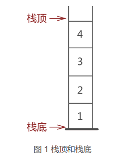

# FreeRTOS框架梳理


## 1.xTaskCreate任务创建分析

```C
		BaseType_t xTaskCreate(	TaskFunction_t pxTaskCode, //任务回调函数
							const char * const pcName,     //任务名称字符串
							const uint16_t usStackDepth,   //任务堆栈	
							void * const pvParameters,	   //参数
							UBaseType_t uxPriority,	       //任务优先级
							TaskHandle_t * const pxCreatedTask )// 任务句柄
```

​	

开始剖析这个函数时，首先需要剖析一个重要的基础概念。

### 1.1 FreeRTOS中栈的生长方向

​	栈的生长方向决定了任务控制块与任务堆栈的创建顺序，由于任务控制块的大小是固定的，但是任务堆栈随着函数调用的深度以及局部变量的定义而发生变动，由此，衍生出一个问题，若**堆栈空间无限制的增长，如果增长方向上有任务控制块，那么任务控制块会有覆盖的风险**。

​	基于上述的问题，我们需要明确堆栈的增长方向，从而根据增长方向，改变任务控制块与任务堆栈空间的申请顺序。

​	栈，先进先出结构，从栈顶进，从栈顶出。

​	


生长方向：

​	**向下生长**表示随着数据的增加，栈顶向内存低地址方向进行移动，即栈底位于高地址，空栈时栈顶位于高地址，随后向低地址进行生长。

​	**向上生长**表示随着数据的增加，栈顶向内存高地址方向进行移动，即栈底位于低地址，空栈时栈顶位于低地址，随后向高地址进行生长。


内存分配问题：

​	FreeRTOS系统中内存管理策略中明确的实现了在连续的内存分配请求中，先分配的内存块位于较低的地址，后分配的位于较高的地址。

​	相反，C库malloc中，通常情况下，堆内存的分配方向是从低地址向高地址进行增长，但是这并非绝对，分配器的行为是实现细节，可能因版本、系统负载或分配模式而异。


基于上述的情况分析可得：

​	当栈空间是**向下增长**（如Cortex-ARM平台）时，栈顶随着数据的增加向低地址进行增长，栈顶初始时应在高地址，即

```C
pxTopOfStack = pxNewTCB->pxStack + ( ulStackDepth - ( uint32_t ) 1 );
```

同时，由于向下进行增长以及先分配的空间位于低地址区，因此，**先申请任务堆栈空间，后申请任务控制块空间**

```
pxStack = ( StackType_t * ) pvPortMalloc( ( ( ( size_t ) usStackDepth ) * sizeof( StackType_t ) ) );

pxNewTCB = ( TCB_t * ) pvPortMalloc( sizeof( TCB_t ) );
```

​	相反，栈空间向上增长（较少见，如某些DSP芯片）时，栈顶随着数据的增加向高地址进行增长，栈顶初始化时应在低地址。即

```C
pxTopOfStack = pxNewTCB->pxStack;
```

同时，由于向上增长以及先分配空间位于低地址区，因此，需要**先申请任务控制块空间，再申请任务堆栈空间**

```C
pxNewTCB = ( TCB_t * ) pvPortMalloc( sizeof( TCB_t ) );

pxNewTCB->pxStack = ( StackType_t * ) pvPortMalloc( ( ( ( size_t ) usStackDepth ) * sizeof( StackType_t ) ) );
```


### 1.2 堆栈空间的对齐问题 

​	FreeRTOS中申请任务堆栈空间后会进行内存对齐的操作。主要是因为对齐的内存访问通常比非对齐访问更高效。

```C
pxTopOfStack = ( StackType_t * ) ( ( ( portPOINTER_SIZE_TYPE ) pxTopOfStack ) & ( ~( ( portPOINTER_SIZE_TYPE ) portBYTE_ALIGNMENT_MASK ) ) ); 
```

​	由于**pxTopOfStack**是一个指针变量，首先，先将其强转成**uint32_t**类型的变量与 取反后的掩码（0x0007）进行按位与操作，随后在强转为指针变量类型，从而实现了内存地址对齐。

​	举例说明：

​	栈的起始地址 (`pxNewTCB->pxStack`) 为 `0x20001000`。

​	栈的深度 (`ulStackDepth`) 为 100（字）。

​	计算得到的初始栈顶指针 `pxTopOfStack`为 `pxNewTCB->pxStack + (ulStackDepth - 1) = 0x20001000 + 99 = 0x20001063`

​	现在，我们需要对 `pxTopOfStack`（地址 `0x20001063`）进行 8 字节对齐。

1. **将指针转换为整数类型进行位操作**：`(portPOINTER_SIZE_TYPE) pxTopOfStack`得到数值 `0x20001063`。
2. **计算掩码**：`portBYTE_ALIGNMENT_MASK`为 `0x0007`，取反后 `~0x0007`得到 `0xFFFFFFF8`。
3. **进行按位与运算**：`0x20001063 & 0xFFFFFFF8`。地址 `0x20001063`的二进制表示为：`0010 0000 0000 0000 0001 0000 0110 0011`掩码 `0xFFFFFFF8`的二进制是：`1111 1111 1111 1111 1111 1111 1111 1000`按位与的结果是：`0010 0000 0000 0000 0001 0000 0110 0000`，即 **0x20001060**。
4. **转换回指针类型**：将结果 `0x20001060`转换回 `StackType_t *`类型，并赋值回 `pxTopOfStack`。

**对齐前后的变化**：

- **原始地址**：`0x20001063`
- **对齐后地址**：`0x20001060`

这个操作使栈顶指针向下调整了 **3 个字节**，从原来的 `0x20001063`移动到了满足 8 字节对齐的 `0x20001060`。


基于上面的知识点，我们可以梳理任务创建函数做了那些事情？

1. 根据堆栈生长方向创建任务控制块，任务堆栈空间

2. 初始化任务堆栈

   1. 计算并赋值栈顶指针位置
   2. 栈顶指针进行字节对齐

3. 根据函数参数，初始化任务控制块内容

   1. 记录任务的名称字符串，名称最大字符数由宏控制，
   2. 记录任务优先级，优先级最大由值有硿宏进行控制，超过最大优先级将默认为最大优先级

4. 初始化任务控制块中的状态列表项以及事件列表项

5. 初始化任务堆栈空间

   ​


