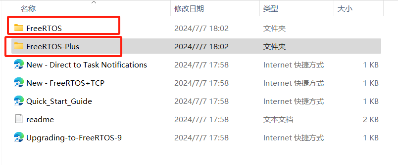
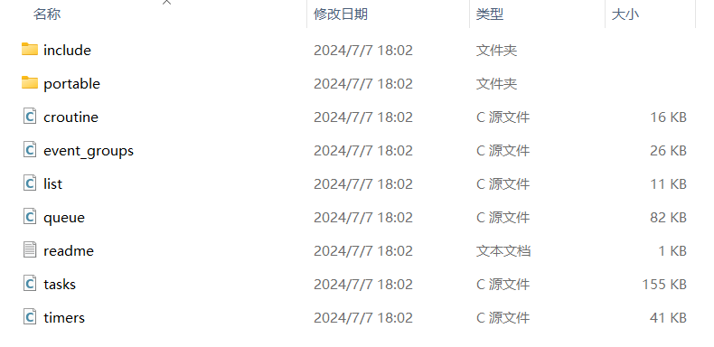
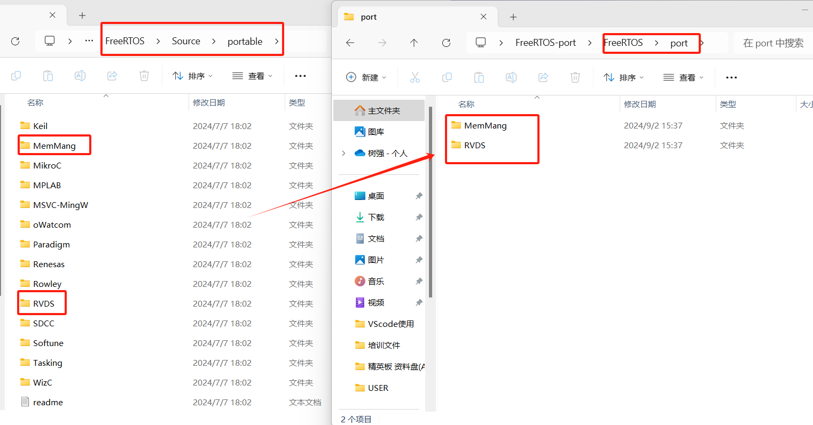
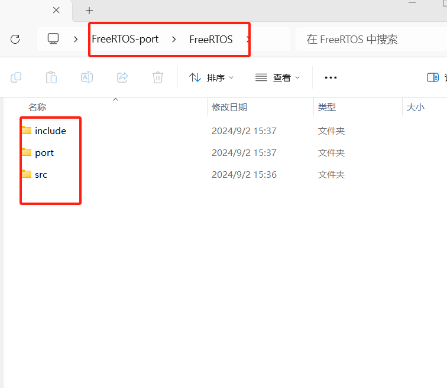
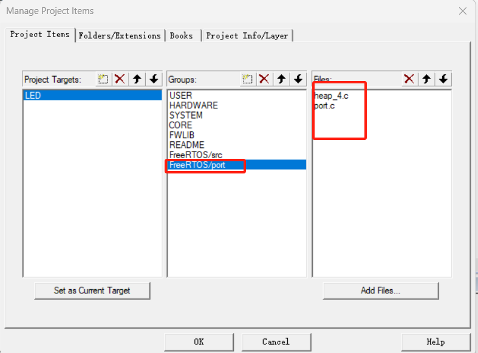
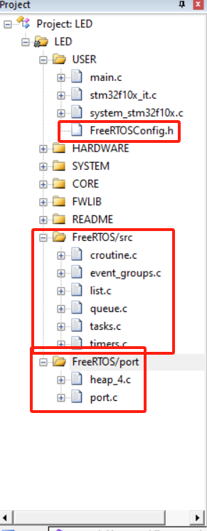
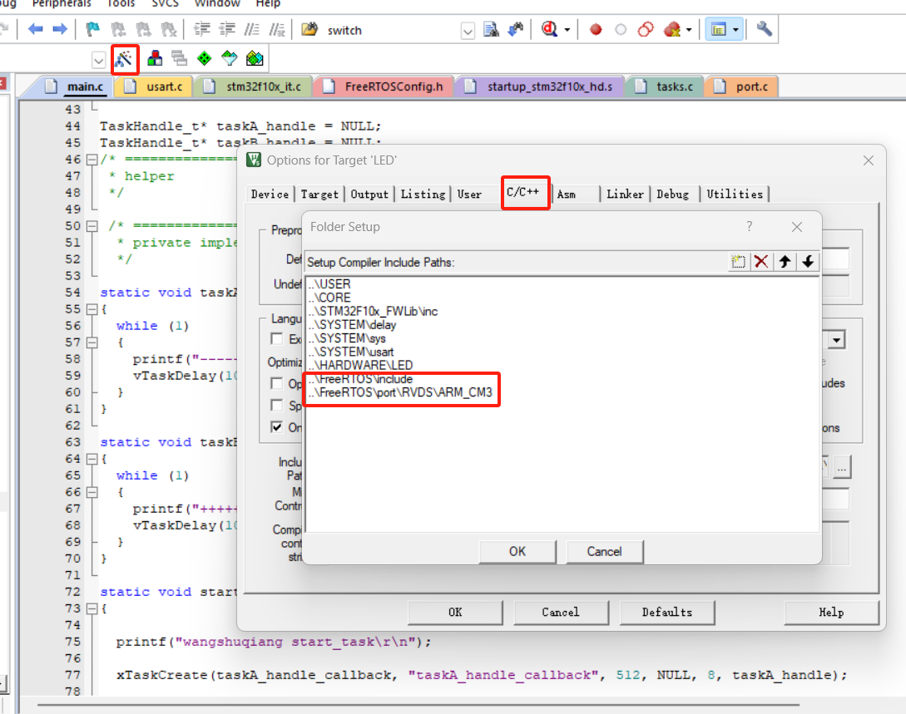

# FreeRTOS硬件平台移植教程

## 简述

本教程用作记录移植FreeRTOS嵌入式操作系统至STM32F03ZET6平台的流程，分为基础篇和提高篇，基础篇主要是记录基础移植步骤，需要移植文件以及文件的作用。按照基础篇移植完成后，可以利用`xTaskCreate`创建任务，开启调度之后，系统可运行创建的任务。提高篇将在基础篇的基础上继续优化系统。


## 基础篇

### 1.准备文件

1. STM32裸机工程模板，一个简单的流水灯工程即可。
2. FreeRTOS程序源码，可从官方网址或者github开源网站获取。本次移植的是V9.0.0版本FreeRTOS

### 2.FreeRTOS源码文件夹介绍

源码程序下载下来之后可以看到有两个文件夹，`FreeRTOS`与`FreeRTOS-Plus`两个文件夹，其中`FreeRTOS`文件夹是我们需要用到的文件夹，而`FreeRTOS-Plus`文件夹中包含的是FreeRTOS系统的高阶应用。



FreeRTOS文件夹中包含Demo例程、License开源许可（暂时不用看）以及Source源码文件。其中主要用到的移植文件为Demo文件夹以及Source源码文件夹。以下进行分别说明

1. Source文件夹

   

   Source文件夹中，`include`文件夹中包含的是FreeRTOS系统中用到的头文件集合，为了管理方便统一放置在`include`文件夹中。

   `portable`文件夹中存放的是平台编译器相关的文件，将软件操作系统与各个平台的底层接口相适配的工作由FreeRTOS技术人员帮助我们实现。官方提供了各个内核的接口文件，我们仅需要正常使用即可。主要使用的文件夹为`portable/RVDS`以及`portable/MemMang`文件夹。其中，`MemMang`存放了FreeRTOS系统内存管理的5个策略文件，FreeRTOS在创建内核对象时采用的是动态申请内存空间方式，而动态申请空间的策略实现就放置在该文件夹下，不同的策略文件申请空间时效率与结果是不同的，移植时必须选择一个策略文件。`RVDS`文件夹存放了不同内核的接口文件。本次移植我们采用ARM_CM3文件夹下的文件。

   剩余的源文件即FreeRTOS系统各部分的实现源文件需要一并移植至STM32工程中。

2. Demo文件夹

   该文件夹下存放的是demo例程，可以打开里面的工程文件，各种开发平台的完整的demo，开发者甚至可以直接使用。

### 3.开始移植FreeRTOS

#### 1.第一步

​	首先在STM32裸机工程中创建一个文件夹，取名为`FreeRTOS`，并在该文件下新建`src`以及`port`，src文件夹用来存放FreeRTOS中的核心源文件，port文件夹中用来存放内存管理以及处理器架构相关代码。

#### 2.第二步

​	将FreeRTOS源码文件夹中的源文件复制到STM32工程中`FreeRTOS/src`目录下。


#### 3.第三步

打开 FreeRTOS V9.0.0 源码，在“FreeRTOSv9.0.0\FreeRTOS\Source\portable”目
录下找到“MemMang”文件夹与“RVDS”文件夹，将它们拷贝到我们新建的
port 文件夹中。



#### 4.第四步

打开FreeRTOS V9.0.0 源码，在“FreeRTOSv9.0.0\ FreeRTOS\Source”目录下找到
“include”文件夹，它是我们需要用到 FreeRTOS 的一些头文件，将它直接拷贝
到我们新建的 FreeRTOS 文件夹中，完成这一步之后就可以看到我们新建的
FreeRTOS文件夹已经有 3个文件夹，这 3个文件夹就包含FreeRTOS的核心文件，
至此，FreeRTOS的源码就提取完成。



#### 5.第五步

复制FreeRTOSConfig.h文件至USER文件夹下：

FreeRTOSConfig.h 文件是 FreeRTOS 的工程配置文件，因为 FreeRTOS 是可以裁剪的
实时操作内核，应用于不同的处理器平台，用户可以通过修改这个 FreeRTOS内核的配置
头文件来裁剪FreeRTOS的功能，所以我们把它拷贝一份放在user这个文件夹下面。

​	可以从FreeRTOSv9.0.0\FreeRTOS\Demo工程中找到`CORTEX_STM32F103_Keil`文件夹下找到FreeRTOSConfig.h文件并复制到USER文件夹下。

#### 6.第六步

上述步骤将FreeRTOS 的源码放到了本地工程目录下，还没有添加到开发环境里面的组文件夹里面，在此步骤中我们需要在keil软件中将文件添加至工程组中

1. keil软件中新建`FreeRTOS/port`组以及`FreeRTOS/src`组，并将相应文件添加至组中







#### 7.第七步

指定FreeRTOS头文件的路径，工程编译时需要将头文件添加至编译路径中。



#### 8.第八步：

修改stm32f10x_it.c文件

​	我们需要实现一个FreeRTOS的心跳时钟，驱动着FreeRTOS的运行，FreeRTOS帮我们实现了SysTick的启动的配置：在port.c文件中已经实现vPortSetupTimerInterrupt()函数，并且FreeRTOS通用的SysTick中断服务函数也实现了：在port.c文件中已经实现xPortSysTickHandler()函数，所以移植的时候只需要我们在stm32f10x_it.c文件中实现我们对应（STM32）平台上的SysTick_Handler()函数即可，同时，PendSV_Handler()与SVC_Handler()这两个很重要的函数都帮我们实现了，在port.c文件中已经实现xPortPendSVHandler()与vPortSVCHandler()函数，防止我们自己实现不了。

具体操作：

1. 实现SysTick_Handler()函数，将下方代码复制到stm32f10x_it.c中对应的SysTick_Handler函数中。

   ```c
   void SysTick_Handler(void) 
   { 
   #if (INCLUDE_xTaskGetSchedulerState  == 1 )      
   if (xTaskGetSchedulerState() != taskSCHEDULER_NOT_STARTED) { 
   #endif  /* INCLUDE_xTaskGetSchedulerState */         
   xPortSysTickHandler(); 
   #if (INCLUDE_xTaskGetSchedulerState  == 1 )     
   } 
   #endif  /* INCLUDE_xTaskGetSchedulerState */ 
   } 
   ```

2. 屏蔽`PendSV_Handler`以及`SVC_Handler`函数实现，采用FreeRTOS系统提供的函数

   FreeRTOS中为考虑到不懂内核底层寄存器以及汇编语言的上层开发者而实现了上述两个函数，位置在本移植工程中的`FreeRTOS-port\FreeRTOS\port\RVDS\ARM_CM3\port.c`文件中，并且用宏定义进行了封装。

   ```c
   #define xPortPendSVHandler 	PendSV_Handler
   #define vPortSVCHandler 	SVC_Handler
   ```

   当屏蔽了stm32f10x_it.c文件中的`SVC_Handler`以及`PendSV_Handler`函数时，系统调用这两个中断处理函数时会自动调用port.c文件中的由FreeRTOS系统提供的函数实现。由此:

   **一定要将上述两个宏定义添加至FreeRTOSConfig.h文件中**

   **一定要将上述两个宏定义添加至FreeRTOSConfig.h文件中**

   **一定要将上述两个宏定义添加至FreeRTOSConfig.h文件中**

   否则，系统运行时找不到两个中断处理函数的实现会运行错误的。

#### 9.第九步

​	该步骤需要开发者确认一下FreeRTOSConfig.h文件中的宏定义最大优先级是否过小。

```c
#define configMAX_PRIORITIES		( 16 )
```

​	根据该数值，在main函数编写测试程序时，调整相对应的任务优先级。

​	**刚开始移植时，这个宏写了个5，我创建的任务优先级分别是8，10，导致创建的两个任务运行时相互打断（因为设置超过最大值时会自动赋值为最大值），当两个任务优先级相同时触发时间片轮转机制，导致时间片结束后相互打断。恶心我一下子**。


至此，在main文件中编写简单的测试程序，编译后烧录至开发板中可以验证移植效果。基础篇结束！！