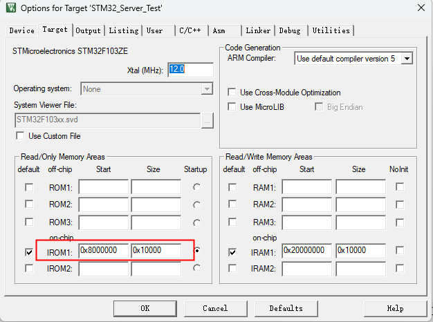

# STM32 bootloader程序启动分析与制作 基础篇

## bootloader是什么？

​	对于经常重装系统的同学以及做嵌入式项目中用到系统升级的同学会经常听说bootloader这个东西，那么究竟什么是bootloader？他是怎么制作出来的？有什么用呢？

​	百度百科中说明如下：

​	在[嵌入式操作系统](https://baike.baidu.com/item/%E5%B5%8C%E5%85%A5%E5%BC%8F%E6%93%8D%E4%BD%9C%E7%B3%BB%E7%BB%9F/361747?fromModule=lemma_inlink)中，BootLoader是在[操作系统](https://baike.baidu.com/item/%E6%93%8D%E4%BD%9C%E7%B3%BB%E7%BB%9F/192?fromModule=lemma_inlink)内核运行之前运行。可以初始化硬件设备、建立内存空间映射图，从而将系统的软硬件环境带到一个合适状态，以便为最终调用[操作系统内核](https://baike.baidu.com/item/%E6%93%8D%E4%BD%9C%E7%B3%BB%E7%BB%9F%E5%86%85%E6%A0%B8/297824?fromModule=lemma_inlink)准备好正确的环境。在[嵌入式系统](https://baike.baidu.com/item/%E5%B5%8C%E5%85%A5%E5%BC%8F%E7%B3%BB%E7%BB%9F/186978?fromModule=lemma_inlink)中，通常并没有像[BIOS](https://baike.baidu.com/item/BIOS/91424?fromModule=lemma_inlink)那样的[固件](https://baike.baidu.com/item/%E5%9B%BA%E4%BB%B6/627829?fromModule=lemma_inlink)程序（注，有的嵌入式[CPU](https://baike.baidu.com/item/CPU/120556?fromModule=lemma_inlink)也会内嵌一段短小的启动程序），因此整个系统的加载启动任务就完全由BootLoader来完成。在一个基于ARM7TDMI core的嵌入式系统中，系统在上电或复位时通常都从地址0x00000000处开始执行，而在这个地址处安排的通常就是系统的BootLoader程序。

​	就拿电脑启动过程分析：首先，系统上电，主板中程序开始运行，这个程序就是我们经常说的bios程序，他的主要工作就是检查系统的整体硬件情况，比如说：内存是否正常？磁盘是否正常？CPU是否正常等。当所有的硬件都正常完成后，程序将跳转到bootloader，这个程序将决定接下来试运行放在C盘中的操作系统程序，还是放在U盘中的启动程序亦或者是U盘中的重装程序。这项功能就是bootloader来实现的。

## STM32中Bootloader作用

​	说明了bootloader的作用，他在STM32中是怎么应用的呢？

​	对于裸机程序开发来说，程序一旦通过测试，并最终版敲定之后，程序不会进行改动，此时只要将固件烧录到Flash的启示位置后，系统上电后会自动跳转至该位置运行。

​	然而，对于有着远程升级的程序来说，这种方式并不可行，上述方法中，flash中只有一份程序，如果在运行过程中进行远程升级，会将本身自己覆盖掉，造成程序卡死。需要划分bootloader + App的模式进行远程升级。

​	其中bootloader负责上电检测是否需要远程升级，不需要升级直接跳转到App程序进行运行，如果需要升级，则将升级程序覆写App程序区域（如果有着升级不成功运行原程序的需求，则需要创建A、B分区的方式）。升级成功后，程序跳转到新的App程序进行运行。由此，实现程序升级的功能。

## STM32中裸机程序在Flash中的分布情况

​	通常的裸机程序中，Keil中会设置程序写在Flash中的位置以及程序规定大小。随后将程序写进Flash后。系统上电。程序运行。

​	在Keil->target界面中设置程序在Flash中的存储位置以及限制大小之后，烧录程序时，会将程序烧录进设定地址。STM32系统启动按照规定将从0x08000000位置启动，因此，我们通常设置程序烧录位置为0x08000000，大小为0x80000（512K），STM32F103ZET6芯片Flash大小为512K。

## bootloader程序与App程序在Flash中分布

​	完成该项功能，需要系统上电后首先运行bootloader程序检测是否有更新程序的必要，因此，需要将

bootloader程序放置在0x08000000的位置上，上电先运行该部分的程序，有该部分程序决定时更新程序，覆写App还是直接跳转到App界面。

​	APP端程序则需要放置在一个特殊的地方，这个特殊的地方需要保证大于bootloader的大小，也要小于Flash

的大小。假设，bootloader的程序大小为16K，放置在0x08000000的位置上，那么App的程序位置就需要放置在0x08000000 + 0x4000(16K) = 0x08004000的位置上。程序大小也要相对应减小。0x80000 - 0x4000 = 0x7C000

## 整体程序上电运行分析      

​	程序启动后，将首先从“中断向量表”取出复位中断向量执行复位中断程序完成启动，而这张“中断向量表”的起始地址是 0x08000004，当中断来临，STM32 的内部硬件机制亦会自动将PC 指针定位到“中断向量表”处，并根据中断源取出对应的中断向量执行中断服务程序。

​	STM32在复位后，先从0X08000004地址取出复位中断向量的地址，并跳转到复位中断服务程序，在复位中断服务程序中执行初始化时钟设置中断向量偏移地址等操作。随后执行main函数，我们的main函数一般都是一个死循环，在main函数执行过程中，如果收到中断请求（发生重中断），此时STM32强制将PC指针指回中断向量表处，然后，根据中断源进入相应的中断服务程序，在执行完中断服务程序以后，程序再次返回main函数执行。

​	另外声明，在IAP功能程序中，运行中这两份程序，这就意味着Flash中有着两份中断向量表，一份是属于bootloader程序的，位于0x08000004，另一份是属于App程序的，位于0x08010004。如果在App程序中没有将中断向量表进行偏移，则假设发生定时器中断时，CPU仍然会从位于0x08000004位置上的中断向量表中搜索中断处理程序，这个位置是属于bootloader的程序位置，中断处理函数中肯定没有东西（主要的业务逻辑都是在App中实现的，肯定不会将中断处理函数写在bootloader中），因此导致中断相应不正确。正确的做法是操作**向量表偏移寄存器**，将中断向量表按照程序烧录位置进行偏移，此时，发生定时器中断后，CPU将从0x08010004位置开始根据中断号进行搜索中断服务程序。从而执行正确的中断服务程序。

​	经过实验验证，在bootloader以及App程序中分别加入定时器中断程序，并分别在定时器中断中打印不同的日志，可以看到，当App程序中不对中断向量表进行偏移时，启动定时器后，当定时器到达时间，触发定时器中断处理函数时，打印的时bootloader程序中的日志，而在App程序中将中断向量表进行偏移之后，定时器到达时间	后，中断处理函数运行，打印的是App程序中的日志。由此可以佐证上述说明。