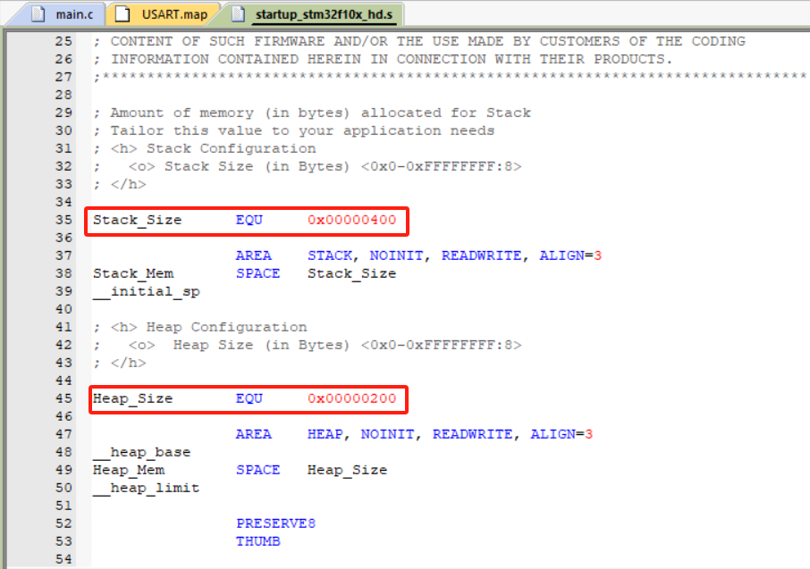

# STM32 + FreeRTOS内存分布分析

## 1.序言

​	本篇笔记为了记录STM32中系统运行过程中SRAM与ROM中的分布，剖析内存中存储的是什么，以及在STM32单片机中运行FreeRTOS系统时，分配给FreeRTOS系统的内存是什么？应该如何正确分配？


## 2.STM32单片机中SRAM与ROM地址分布

​	首先，我们应该明确STM32单片机中内存地址映射关系。

​	众所周知，STM32作为一款32位总线的单片机，最大可寻址空间位2^32 = 4G空间。即可寻址范围为0x00000000 ~ 0xFFFFFFFF。如下图右侧所示：

​	

​	从上方存储器(包含了Flash地址、SRAM地址以及寄存器地址等)映射可以得出，ARM Cortex-M3架构中可以寻址空间为0x00000000-0xFFFFFFFF，按照粗略划分，从大致有代码区，SRAM区，寄存器区，外部RAM区等，每个区M3内核都大致分配了区域，至于具体到开发板中的具体地址，则由芯片厂商(ST意法半导体等)自行定义。

​	本人的开发版为STM32F103ZET6，Flash大小为**512K**，SRAM大小为**64K**，从下方示意图可得出，SRAM地址空间为**0x00000000-0x00010000**。存储代码的Flash地址空间为**0x0800 0000-0x0807 FFFF**。


## 3.程序分析 

​	以下，我们来分析一下一段代码在目标机中内存分布情况。

```C
#include <stdio.h>
int main()
{
  while(1)
  {
    ;
  }
}
```

​	上边是一段最简单的程序代码。main函数中只有一个while循环。此时，使用keil编译器生成的output信息为：

​	``Program Size: Code=928 RO-data=336 RW-data=8 ZI-data=1832  ``

​	这里解释一下各个字段的含义：

​	`code`:代表执行的代码，程序中所有的函数都位于此处。

​	`RO-data段`:代表只读数据，程序中所定义的全局常量数据和字符串都位于此处，如const型.

​	`RW-data段`:代表已初始化的读写数据，程序中定义并且初始化的全局变量和静态变量位于此处.

​	`ZI-data段`：代表未初始化的读写数据，程序中定义了但没有初始化的全局变量和静态变量位于此处。Keil编译器默认是把你没有初始化的变量都赋值为例0。

​	上述数值单位都是字节Byte。

以下是通过对上述程序进行改造得到的结果。

```C
// 干净的程序   
// Program Size: Code=928 RO-data=336 RW-data=8 ZI-data=1832

// 增加 static uint8_t name[20] = "wangshuqiang";并打印
// Program Size: Code=1328 RO-data=336 RW-data=28 ZI-data=1836  

// 增加 宏定义并打印 #define NAME "wangshuqiang"
// Program Size: Code=1340 RO-data=336 RW-data=8 ZI-data=1832  

// 增加const变量并打印 const uint8_t name[20] = "wangshuqiang";
// Program Size: Code=1328 RO-data=356 RW-data=8 ZI-data=1832  

// 增加局部常量并打印 uint8_t name[20] = "wangshuqiang";
// Program Size: Code=1440 RO-data=356 RW-data=8 ZI-data=1832  
// 当在函数内初始化数组时，如果使用字符串字面量，相关的常量数据会被放置在RO-data段，从而导致该段的大小增长

// 增加局部变量并打印 uint8_t name[20] = {0};
// Program Size: Code=1412 RO-data=336 RW-data=8 ZI-data=1832  

// 增加静态未初始化变量并打印 static uint8_t name[20];这里应该是字节对齐了
// Program Size: Code=1328 RO-data=336 RW-data=8 ZI-data=1856  
```

​	

​	上述的4中数据段中，`code`为代码段，一定要烧录到Flash中，供上电时处理器取指并执行。注意：相较于计算机运行原理不同，在嵌入式单片机中，处理器是从处理器中取值并执行。而计算器是将程序加载到内存中并执行。二者间有区别。`RO-data段`存储常量数据，该类数据也需要存储进Flash中，程序运行时，处理器从falsh中读取。`RW-data`数据用来存储已经定义并且初始化的全局/静态变量，这类数据需要在程序一开始运行时保持初始化的数值，因此，也需要存储到Flash中。而对于`ZI-data`数据，存储的是未定义的或定义为0的全局/静态变量，有些编译器会将这类数据在程序运行时直接设置为0，这类数据不需要记住，因此不放入flash中。

​	根据上述说明可以得出，程序烧录至**Flash**中占据的空间为：

​	**Flash = Code + RO Data + RW Data**

​	而程序运行时所占据的**SRAM**空间为：

​	**RAM = RW-data + ZI-data**

​	程序运行时，需要将Flash中存储的`RW-data`加载到SRAM中，此外，`RW-data`+`ZI-data`的大小只是全局变量，程序中更多使用的是局部变量以及malloc函数分配的动态空间。而这些变量分别存贮在堆区和栈区，且这两个空间大小不确定。于是采用配置文件分配的策略。开发者可以动态调整堆栈区的空间大小。且在SRAM空间中，低地址存放的是`RW-data`和`ZI-data`数据段，堆栈区空间位于高地址段，且栈空间向下增长，堆空间向上增长。


## 4.keil编译map文件分析

​	我们可以借助keil软件在编译过程中生成的内存map文件验证上述的内存理论知识的正确性。

​	map文件生成方法：

​	keil软件中点击编译按钮后等待编译完成，随后双击**target**文件即可弹出.map文件。

​	map文件中最上方会显示编译器信息，下方的**Section Cross References**段显示程序的调用关系，显示每个段中哪些符号引用了其他段的符号，帮助开发者理解代码之间的依赖关系。


​	**Removing Unused input sections from the image.**该段代码中显示了去除未使用的输入段，通常由编译器优化等级决定。通常是定义了但是并没有使用的变量。基于这一点，keil在调试的时候会发现有些地方没有办法打断点，其实是编译器将未使用的代码优化掉了。所以打不了断点。

​	**Image Symbol Table**段则显示包含程序中所有符号（如变量和函数名）的数据结构，专注于程序中的符号及其相关信息。


​	与之相似的是**Memory Map of the image**段，这部分显示的是程序在内存中的布局，主要关注程序在内存中的布局和占用情况。


**Image component sizes**段则统计了每个文件编译之后的code、RO-data、RW-data大小。


map文件最后则会统计工程的各段内存占用情况。


***

***

***


​	通过分析**Memory Map of the image**段最后我们可以得出,`code`+`Ro-data`段占用内存直至**0x08001594**,从**0x08001594-0x0015cc**段为RW-data数据，即程序中初始化不为0的静态/全局变量。这段空间内代码在程序运行时需要加载到SRAM中，即将这些变量加载到SRAM中**0x20000000**的地址，直到**0x20000038**结束。加载完成`RW-data`后还需要加载`ZI-data`,这段数据将紧接着`RW-data`段数据，地址从**0x20000038-0x20000160**结束。随后，将加载堆栈空间。至于堆栈空间的大小，则是在STM32启动文件中进行动态配置，如下图所示




## 5.运行FreeRTOS系统下如何确保分配合适的空间

​	经过上边的说明，我们要讨论最核心的问题

​	**运行FreeRTOS系统，如何给RTOS分配最合适的空间大小呢？**

​	要解决这个问题，我们首先要明确FreeRTOS中malloc用到的空间从哪里来？了解FreeRTOS的内存管理篇章后可得知。FreeRTOS提供了5中内存管理机制。heap1-5.c，每一个源文件都有着不同的内存分配策略。各个文件具体用哪个这里不多解释。通常使用最多的是heap4文件策略。

​	FreeRTOS系统总共的空间有宏定义**configTOTAL_HEAP_SIZE**控制，单位是字节。在heap4文件中，会申请一个未初始化的静态数组，存放到`ZI-data`段，所有pvPortMalloc接口以及vPortFree接口操作的都是`ucHeap`数组。由此，在使用FreeRTOS系统时，malloc尽量使用FreeRTOS提供的接口获取动态内存，如此方便监视系统内存的使用情况。

```C
static uint8_t ucHeap[ configTOTAL_HEAP_SIZE ];
```

​	如何确定configTOTAL_HEAP_SIZE应该分配多少呢？根据SRAM内存空间分布可知，只需要将`RW-data`,`ZI-data`,`heap`,`stack`总共的空间控制在芯片最大SRAM范围内即可。`heap`与`stack`的空间大小可以通过启动文件得出，`RW-data`大小可以通过编译器输出结果得出。由此在分配时经过估算即可得出分配的是否合理。

​	