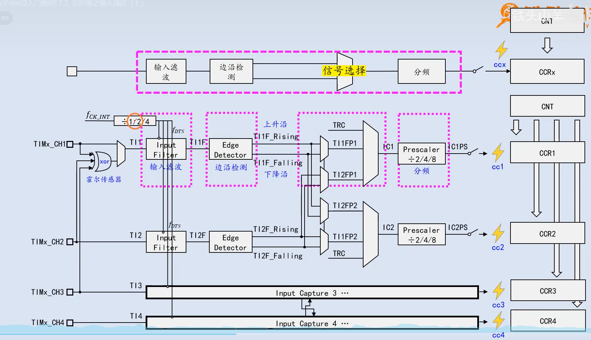
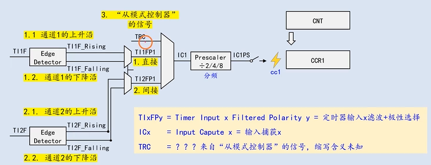

# STM32知识点基础篇梳理分析

## 1.中断篇

### 1.什么是中断

​	CPU在执行当前程序时，因应系统出现的紧急情况而暂停，转而去执行处理紧急事件的特殊程序。处理完毕后，CPU会自动返回到原先暂停的程序中继续执行。这种因外界原因导致程序执行被打断的情况称为中断

### 2.STM32中断触发过程

1. **中断源触发**：外部设备触发相应中断源，系统检测到中断源触发
2. **中断控制器进行处理分析**：根据初始化时配置的中断源的抢占优先级和响应优先级，决定当前是否处理该中断以及是否由需要暂时挂起的其他优先级中断。
3. **查找中断处理函数地址**：CPU根据中断号，在中断向量表中进行查找相对应的中断处理函数。中断向量表维护在启动文件中，放置在Flash中（0x080000 + 4）。4是栈指针地址。如果有bootloader程序，则需要偏移中断向量表的位置。
4. **保存上下文**：系统将当前任务的寄存器值压栈，保存现场。
5. **执行中断服务程序**：CPU转而执行中断服务程序，执行该程序必须快进快出。且不可以调用不可重入函数。
6. **恢复现场**：执行完中断之后，将之前压栈的现场弹栈，已回复之前保存的现场。
7. **返回主程序**：中断程序执行之后，弹栈完成后，继续执行主程序

### 3.中断优先级

​	STM32中，中断分为抢占优先级与响应优先级，这两点在使用时需要遵循。

1. 第一，如果两个中断的抢占优先级和响应优先级都是一样的话，则看哪个中断先发生就先执行。		
2. 高优先级的抢占优先级是可以打断正在进行的低抢占优先级中断的，而抢占优先级相同的中断，高优先级的响应优先级中断不可以打断低响应优先级的中断。
3. 如果两个中断的 **抢占优先级不同**，那么 **抢占优先级高的中断** 将会先被处理，不论它们的 **响应优先级** 是否相同，**响应优先级相同** 只会在抢占优先级相同的情况下才起作用

### 4.中断优先级管理 

​	STM32中断是通过配置寄存器NVIC寄存器进行管理	，其中，`ISER`寄存器是一个中断使能寄存器组，支持256个中断，F103只用了其中的前60位。	若要使能某个中断，只需要将中断对应的`ISER`位置1即可。`ICER`寄存器，是一个中断除能寄存器组，位数与`ISER`寄存器相同，但是功能作用与其相反，若想要清除某个中断的使能，只需要将`ICER`寄存器中断对应的位置1即可。注意：对于NVIC的这些寄存器而言，都是写1有效，写0无效。与平常寄存器中写1使能，写0失能不同。

​	寄存器`IP`：全称是：Interrupt Priority Registers，是一个中断优先级控制的寄存器组，这是一个数组，控制着M3内核的256个中断，数组类型为`uint8_t`,而每个可屏蔽中断占用的8bit并没有全部使用，而是 只用了高4位,这4位，又分为抢占优先级和子优先级。抢占优先级在前，子优先级在后。这里说明的子优先级就是上边提到的响应优先级。这两个优先级各占几个位又要根据SCB->AIRCR中的中断分组设置来决定。

​	这里简单介绍一下STM32的中断分组：STM32将中断分为5个组，组0~4。该分组的设置是由SCB->AIRCR寄存器的bit10~8来定义的。

| 组    | AIRCR[10：8] | bit[7：4]分配情况 | 分配结果             |      |      |
| ---- | ----------- | ------------ | ---------------- | ---- | ---- |
| 0    | 111         | 0：4          | 0 位抢占优先级，4位响应优先级 |      |      |
| 1    | 110         | 1：3          | 1 位抢占优先级，3位响应优先级 |      |      |
| 2    | 101         | 2：2          | 2 位抢占优先级，2位响应优先级 |      |      |
| 3    | 100         | 3：1          | 3 位抢占优先级，1位响应优先级 |      |      |
| 4    | 011         | 4：0          | 4 位抢占优先级，0位响应优先级 |      |      |

​	通过这个表，我们就可以清楚的看到组0~4对应的配置关系，例如组设置为3，那么此时
所有的60个中断，每个中断的中断优先寄存器的高四位中的最高3位是抢占优先级，低1位是
响应优先级。每个中断，你可以设置抢占优先级为0~7，响应优先级为1或0。抢占优先级的
级别高于响应优先级。而数值越小所代表的优先级就越高。


## 2.外部中断篇

### 1.什么是外部中断（EXTI）

​	外部中断是[单片机](https://baike.baidu.com/item/%E5%8D%95%E7%89%87%E6%9C%BA/102396?fromModule=lemma_inlink)实时地处理外部事件的一种内部机制。当某种外部事件发生时，单片机的[中断系统](https://baike.baidu.com/item/%E4%B8%AD%E6%96%AD%E7%B3%BB%E7%BB%9F/10480702?fromModule=lemma_inlink)将迫使[CPU](https://baike.baidu.com/item/CPU/120556?fromModule=lemma_inlink)暂停正在执行的[程序](https://baike.baidu.com/item/%E7%A8%8B%E5%BA%8F/13831935?fromModule=lemma_inlink)，转而去进行中断事件的处理；中断处理完毕后．又返回被中断的程序处，继续执行下去。

### 2.外部中断资源

​	STM32的每个IO都可以作为外部中断的中断输入口，然而，STM32F103的总共支持19个外部中断，其中，**线0-15**对应外部IO的输入中断，**线16**连接到PVD输出，**线17**连接到RTC闹钟事件，**线18**连接到USB唤醒事件。由上述资源说明可以观察出，STM32中断线数量远小于GPIO个数，因此需要进行映射设计。

​	如何将16个中断线与全部GPIO构建映射关系？我们知道，GPIO每一个port都有15个引脚端口，即0-15，因此，我们将每一个port上的引脚分别映射到编号为0-15的中断线中。即中断线0上连接着PA0，PB0，PC0...PG0，中断线1连接着PA1，PB1，PC1...PG1。由此，便实现了16根线控制所有的GPIO引脚。

### 3.外部中断配置方法

1. 使能复用时钟，配置GPIO为输入模式

2. 首先需要明确将GPIO与中断线的映射关系，调用函数接口绑定二者关系

   ```c
   GPIO_EXTILineConfig(GPIO_PortSourceGPIOE,GPIO_PinSource3);//将GPIOE.3与中断线3进行绑定
   ```

3. 配置外部中断EXTI寄存器结构体

   需要配置的选项有，中断线、中断模式以及中断触发源。

4. 配置NVIC中断优先级

   配置NVIC中断源，中断抢占优先级及响应优先级，使能中断

5. 编写外部中断线对应的中断处理函数

   1. 检测是否是正确的中断线触发中断
   2. 实现业务逻辑
   3. 清除中断标志位

## 3.时钟篇

​	单片机时钟是单片机工作的基础，它为单片机提供了必要的时序信号，确保单片机按照既定的节奏执行指令和操作。时钟信号可以看作是单片机的“心跳”，它决定了单片机的工作频率和执行速度。单片机各种外设都需要时钟的参与，如何配置系统的时钟，就需要了解STM32的时钟树配置。通过配置时钟树，我们可以初始化各个外设的时钟频率。

​	以下分析STM32F103控制板默认时钟配置。

​	STM32包含四种时钟源，高速外部时钟（HSE），高速内部时钟（HSI），低速内部时钟（LSI），低速外部时钟（LSE）。通常，高速时钟用来作为系统时钟的时钟源，低速内部时钟频率为40K，用作系统独立看门狗使用。低速外部时钟时钟频率大多为32.768K，通常用作RTC时钟使用。

​	题外话，通常实时时钟RTC采用的晶振频率为32.768KHZ，是因为32.768KHZ是**2的15次方**，只需要将该时钟源进行15次二分频，即可得到频率为1HZ的时钟频率，这对于以秒为单位的计时功能实现非常关键。同时，该频率的晶体振荡器具有较高的稳定性，能够在不同的环境条件下保持相对稳定的输出，从而为电路提供准确可靠的时钟信号。

### STM32默认时钟配置

​	STM32单片机在上电时，运行启动文件，初始阿堆栈指针，初始化中断向量表，响应复位中断程序，在复位中断程序中，进行系统初始化，随后跳转至main函数。

​	在上述熊初始化过程中，系统调用System_Init()函数，在该函数中设置系统时钟为72MHZ。

​	具体方式为设置RCC时钟控制器的**CFGR**以及**CR**寄存器。 

​	


​	STM32时钟采用高速外部时钟作为时钟源，硬件板中焊接8M外部晶振，直接传输值PLL锁相环进行倍频，这里可以看到，PLL锁相环有两种源，一种是由8M的内部高速时钟进行2分频，另一种就是直接由PLLXTYPE进行供给，STM32默认采用后者。时钟信号经过PLL锁相环9倍倍频，输出72M赫兹频率，并在SW处选择PLL锁相环时钟作为系统时钟输入，由此，系统时钟频率设置为72MHZ。

​	与此同时，PLL锁相环输出端经过USB时钟预分频器，1.5倍分频，得到48MHZ频率作为USB接口时钟频率。

​	系统时钟经过AHB预分频器不分频，直接供给SDIOCLK、FSMCCLK、核心存储器以及DMA总线，由此，上述说明的外设时钟频率皆为72MHZ。

​	经过APB1分频器2分频的时钟信号将直接供给与APB1外设总线，挂载至APB1总线上的外设，时钟频率为36MHZ，同时，由于APB1的分频系数为2，因此，定时器2-7的时钟频率为PCLK1时钟频率的2倍，即72MHZ。

​	经过APB2分频器的时钟频率将不分频，以72MHZ频率输出至PCLK2总线。由于APB2分频系数为1，则PCLK2总线时钟将直接输出至定时器1、定时器8。

​	经过APB2分频器的时钟频率，输出至ADC预分频器时为72MHZ，使用ADC模块时，需要配置ADC预分频系数，推荐使用6分频或8分频，ADCCLK不建议超过14MHZ。

​	综上所述，定时器1-8的时钟频率都是72MHZ。

## 4.定时器篇 

### 1.定时器分类

​	STM32F103共有8个定时器资源，共分为三种定时器，基本定时器（TIME6、TIME7），通用定时器（TIME2-TIME5），以及高级定时器（TIME1、TIME8）。

- 基本定时器的功能相对简单，通常用于 **延时操作** 和 **周期性中断**。
- 通用定时器比基本定时器功能更加丰富，支持 **输入捕获**、**输出比较**、**PWM 生成**、**时间测量**等功能，适合用来处理更复杂的任务。
- 高级定时器具有更多的控制功能，适合复杂的 **电机控制**、**高精度时间控制** 等任务。它们不仅支持常规的功能，还支持 **死区时间控制**、**互补 PWM 输出**、**高速脉冲宽度调制**等高级特性。


### 2.定时器组成

​	晶振：通常采用石英晶振，石英晶振通电后可以在每秒钟产生固定数量的正弦信号波。

​	时钟树：晶振产生的信号波经过锁相环倍频后，输出至各总线中，作为哥哥总线的时钟频率，HCLK，PCLK1，PCLK2等。

​	预分频器：定时器会将总线的时钟频率分频从而降低时钟频率，得到的就是定时器的分辨率

​	计数器与自动重装载寄存器：当经过预分频器之后的时钟信号到达计数器后，每检测到一个信号波，计数器就加1，一直加到数值等于自动重装载寄存器的数值时，会产生一个信号波。

​	重复计数器：该部分只有高级定时器才有，作用时接收计数器溢出后产生的信号波，当接收到的信号波个数与设定值相同时，触发一个update事件从而产生一个update中断。对于通用定时器以及基本定时器来说，当计数器到达自动重装载数值时，直接产生一个update事件，进而触发update中断。

​	影子寄存器：使用定时器的过程中，通常需要更改自动重装载寄存器的数值，从而更改定时器溢出周期。考虑以下两种情况：

1. 当新的自动重装载寄存器值大于当前计数器值时，此时可以想象成可以正常配置。

2. 当新的自动重装载寄存器值小于当前计数器值时，设置完成后，定时器会一直的向上计数，一直计数到最大值之后溢出，计数器清零后计数增长到新的自动重装载寄存器值才会触发一次update更新事件。这中间的时间间隔将会很长。

   基于上述两点，引申出影子寄存器的概念。当设置时，将新的自动重装载寄存器值写入到影子寄存器中，只有当触发了一次update事件之后，才会将影子寄存器中的数值更新到自动重装载寄存器中。由此解决了上述第二点的问题

### 3.通用定时器设置时间间隔配置

1. 使能通用定时器时钟
2. 配置定时器结构体参数
   1. **TIM_Period** ：配置自动重装载寄存器周期的值
   2. **TIM_Prescaler** ：配置时钟频率的预分频值
   3. **TIM_ClockDivision**：配置时钟分割系数，输入捕获功能常用，由于输入通道可能会收到高频噪声的影响，可以通过该参数降低内部数字滤波器的采样时钟频率。帮助滤除高频噪声，提高信号稳定性。
   4. **TIM_CounterMode** ：设置定时器计数模式
   5. 配置定时器中断类型并使能定时器

​       说明:定时器触发周期是通过上述1，2参数配置而成。我们在时钟篇提到过，定时器的时钟周期为72M，经过定时器分频后得到定时器计时频率，此时剋计算出定时器计时周期，将计时周期乘以自动重装载寄存器值即可得到定时器溢出中断的周期。

​	举例如下：想要配置500ms的定时器，自动重装载寄存器数值以及预分频值？

​	500ms = （预分频系数/72M） * 自动重装载寄存器数值

​	定时器demo中，自动重装载寄存器数值为4999，预分频值为7199。

### 4.通用定时器框图理解


​	针对通用定时器，将其整体划分为5部分，其中，第一部分为时钟发生器，第二部分为时基单元，第三部分为输入捕获部分，第四部分为捕获/比较寄存器，第五部分为输出比较部分。

​	**第一部分：**该部分为时钟发生器，通过时钟篇我们了解到，定时器的时钟源由四种，内部高速，外部高速，外部高速，外部低速，最终产生**TIMXCLK**时钟信号输出至第一部分中，作为时钟源一种来源。当然还有其他几种来源，我们暂不分析。

​	**第二部分：**第二部分包含PSC预分频器、自动重装载寄存器和CNT计数器。来自第一部分的时钟源经过预分频器后分频得到时钟信号CK_CNT，使得CNT计数器加1或者减1，此时在自动重装载寄存器中有一个预先设定的装载值，当计数器的值达到装载值的时候，会产生溢出事件，然后触发中断。

​	**第三部分：**该部分为输入捕获部分，主要用来捕获外部信号，如脉冲宽度等。TIMx_CH1——TIMx_CH4 这四个通道，在芯片中都有对应的引脚，当脉冲从通道口进入时，经过输入滤波器（抗干扰的作用），然后经过边沿检测器检测到上升沿（下降沿），经过分频器，输入到第四部分中的捕获寄存器中，然后捕获寄存器记录此刻CNT计数器的值，当下一次下降沿（上升沿）过来时，也记录下CNT计数器的值，这样就可以计算出输入脉冲的宽度。

​	**第五部分**：该部分为输出比较部分，通常用来输出PWM波等。由框图可知，同一个通道输入捕获与输出比较不可以同时进行。在比较寄存器中预先设定一个值，计数器从初始值到装载值之间计数时，当正好等于比较寄存器中的预设值时，控制TIMx_CH1——TIMx_CH4通道输出低电平或者高电平，这样随着计数器不断的计数，就可以获得一个脉冲，通过调整预设值，就可以调整脉冲宽度，调整初始值和装载值就可以调整周期。

​	定时器寄存器中有两个捕获/比较模式寄存器，分别为**TIMx_CCMR1**与**TIMx_CCMR2**，每个捕获/比较模式寄存器可以控制两个通道的捕获/比较配置，因此，两个寄存器共可以配置定时器的四个通道。

### 6.定时器输入捕获功能

​	输入捕获部分功能分为如下图中的几个部分




1.  输入滤波：将信号中的毛刺部分滤掉，得到纯净的信号方波
2.  边沿检测：检测信号方波中的上升沿以及下降沿，当出现上升沿时，会向外输出一个上升沿脉冲信号，同理，当出现下降沿时，会向外输出一个下降沿脉冲信号。
3.  信号选择：本质上就是一个T型复用器，根据想要捕获的信号类型决定T型复用器的输出是哪种信号。
4.  分频器：可以设置分倍频系数X，只有当检测到X数量个信号沿是，才会输出一次脉冲.


##### 1.输入滤波：

​	目的是将输入信号中的毛刺滤除干净，得到纯净的方波信号

​	 

​	如上图所示，原始信号中有存在毛刺，此时我们需要设定两个参数来进行滤波，第一个参数为滤波器的采样频率，另一个参数为判定次数。

​	假定我们需要检测高电平持续时间，对原始信号进行采样，只有当采集到高电平持续时间大于判定次数后，我们才认为此时检测到了高电平，而高电平持续时间低于判定次数的毛刺会被过滤掉。

​	上述的两种滤波参数都可以通过成员变量`TIM_ICFilter`进行设置，取值范围为0x0-0xF。本质上还是设置寄存器

​	

##### 2.信号选择



​	该部分作用为从众多的输入信号中给选择一路输出至下一级的分频器中，其中，通道一与通道二有组成了一组，通道三与通道四由组成了一组。即通道一可以输出至IC1或IC2，通道二也可以输出至IC1或IC2。通道三、四同理

​	

以下，以测量高电平为例子说明


​	将原始信号接在通道一，通道二悬空，将经过滤波、边沿检测后的信号分别输出至IC1与IC2，通道一配置为将测上升沿信号，直接检测方式（`TIM_ICSelection_DirectTI`）,通道二配置为检测下降沿信号，间接检测方式（`TIM_ICSelection_IndirectTI`）,由此，当测量脉宽时，上升沿信号发生时，经过通道一检测到后产生脉冲，使得CCR1拍照记录当前定时器计数值，当下降沿信号发生时，经过通道二检测后产生脉冲，使得CCR2拍照记录定时器值，二者相减乘以定时器频率即可得到脉冲宽度。

​	注意：在STM32定时器的输入捕获功能中，**只要检测到配置的边沿信号（上升沿/下降沿），硬件会自动将当前计数器值（TIMx_CNT）写入对应的捕获/比较寄存器（TIMx_CCRx）**，无论是否使能中断。这是由硬件机制独立完成的，与中断使能状态无关。也就是说，当输入通道检测到配置的边沿信号（通过`TIMx_CCER`寄存器的`CCxP/CCxNP`位设置极性），硬件会立即将当前`TIMx_CNT`的值锁存到`TIMx_CCRx`寄存器中。这一过程完全由硬件触发，无需软件干预。

### 7.定时器输出比较功能

​	有时我们需要是用单片机产生方波信号，用来驱动外部设备，如产生PWM方波，此时就需要使用定时器的输出比较功能，系统框图如下：

​	

​	其中，定时器按照设定频率进行计数，每一次计数将数值与CCR1进行比较，再根据模式选择，以及后方的复用选择器决定输出的是**有效电平**还是**无效电平**。

​	模式选择共有8种模式可以选择，模式以及作用如下图所示： 


​	其中，有效电平与无效电平，跟实际的高低电平不同，需要根据寄存器`TIMx_CCER`的CCXP位进行配置。如下图：


​	当该位配置为0时，有效电平为高电平，无效电平为低电平，当该位配置为1时，有效电平为低电平，无效电平为高电平。

## 5.GPIO篇

​	STM32单片机中，GPIO模式共有以下八种模式：

- GPIO_Mode_AIN **模拟输入**

- GPIO_Mode_IN_FLOATING **浮空输入**

- GPIO_Mode_IPD **下拉输入**

- GPIO_Mode_IPU **上拉输入**

- GPIO_Mode_Out_OD **开漏输出**

- GPIO_Mode_Out_PP **推挽输出**

- GPIO_Mode_AF_OD **复用开漏输出**

- GPIO_Mode_AF_PP **复用推挽输出**


  STM32中每一个GPIO端口都有如下的结构：

  

    1. **保护二极管作用**：IO引脚上下两边两个二极管用于防止引脚外部过高、过低的电压输入。当引脚电压高于VDD时，上方的二极管导通；当引脚电压低于VSS时，下方的二极管导通，防止不正常电压引入芯片导致芯片烧毁。
    2. TTL肖特基触发器：信号经过触发器后，模拟信号转化为0和1的数字信号。


### 1.输入模式：

**模拟输入**：模拟输入模式下，I/O端口的模拟信号（电压信号，而非电平信号）直接模拟输入到片上外设模块。信号流向如下图所示：


**浮空输入：**浮空输入模式下，I/O端口的电平信号直接进入输入数据寄存器。也就是说，I/O的电平状态是不确定的，完全由外部输入决定；如果在该引脚悬空（在无信号输入）的情况下，读取该端口的电平是不确定的，信号流向如下图所示：


**上拉输入：**上拉输入模式下，I/O端口的电平信号直接进入输入数据寄存器。但是在I/O端口悬空（在无信号输入）的情况下，输入端的电平可以保持在高电平；并且在I/O端口输入为低电平的时候，输入端的电平也还是低电平。


**下拉输入：**下拉输入模式下，I/O端口的电平信号直接进入输入数据寄存器。但是在I/O端口悬空（在无信号输入）的情况下，输入端的电平可以保持在低电平；并且在I/O端口输入为高电平的时候，输入端的电平也还是高电平。


### 2.输出模式：	

**开漏输出**：开漏输出模式下，通过设置位设置/清除寄存器或者输出数据寄存器的值，途经N-MOS管，最终输出到I/O端口。这里要注意N-MOS管，当设置输出的值为高电平的时候，N-MOS管处于关闭状态，此时I/O端口的电平就不会由输出的高低电平决定，**而是由I/O端口外部的上拉或者下拉决定**；当设置输出的值为低电平的时候，N-MOS管处于开启状态，此时I/O端口的电平就是低电平。同时，I/O端口的电平也可以通过输入电路进行读取；注意，I/O端口的电平不一定是输出的电平。


**推挽输出：**

​	推挽输出模式下，通过设置位设置/清除寄存器或者输出数据寄存器的值，途经P-MOS管和N-MOS管，最终输出到I/O端口。这里要注意P-MOS管和N-MOS管，当设置输出的值为高电平的时候，P-MOS管处于开启状态，N-MOS管处于关闭状态，此时I/O端口的电平就由P-MOS管决定：高电平；当设置输出的值为低电平的时候，P-MOS管处于关闭状态，N-MOS管处于开启状态，此时I/O端口的电平就由N-MOS管决定：低电平。同时，I/O端口的电平也可以通过输入电路进行读取；注意，此时I/O端口的电平一定是输出的电平。


​	输出模式中，主要由开漏输与推挽输出，另外还有复用推挽和复用开漏模式，带有复用与没带有开漏的区别主要是：在**推挽以及开漏模式**中，IO端口的输出电平主要由CPU直接写输出数据寄存器，随后经过输出驱动器后给到IO端口。而在**复用推挽以及复用开漏模式**中，高低电平的来源是通过片上外设模块的复用功能传输到输出驱动器模块进而驱动IO端口。

​	

**开漏输出与推挽输出的区别：**

- 开漏输出：只可以输出强低电平，高电平得靠外部电阻拉高。输出端相当于三极管的集电极。适合于做电流型的驱动，其吸收电流的能力相对强(一般20ma以内)；
- 推挽输出:可以输出强高、低电平，连接数字器件。


### 3.GPIO速率：

STM32GPIO配置时，通常需要我们设置GPIO速率，以下我们需要对GPIO速率做出一些分析：

​	在STM32微控制器中，**GPIO速率**（或称为**GPIO时钟速度**、**GPIO频率**）是指通过STM32的GPIO引脚传输数据的速度。它对GPIO端口的**数据输入和输出速率**有直接影响，决定了信号传输的速度和响应时间。

​	首先，GPIO速率影响数据在GPIO引脚上的传输速率。当我们通过GPIO发送数据（例如输出高低电平），这个速率决定了数据能够传输的频率。例如，如果GPIO速率较低，数据传输的速度就会受到限制，可能导致数据更新的延迟或不稳定。在STM32中，GPIO经常用作与外部设备（如传感器、显示器、LED、按键等）的接口。如果外部设备对输入信号的频率有要求，GPIO速率就会影响设备与MCU的通信效率。对于需要高频率操作的外设（例如SPI、I2C、PWM信号等），GPIO速率会影响信号的稳定性和精确度。

​	同样的，GPIO速速率对于输入信号速率也有影响。对于一些高频输入信号，如脉冲计数、捕获输入、PWM信号采样等，GPIO的输入速率决定了它能够多快地响应输入信号的变化。如果GPIO的速率较低，可能会导致采样的时间窗口过长，从而错过高频信号的某些变化。

​	但是，并不是说信号速率越高越好，**1.高频率的GPIO操作通常会消耗更多的功率**。因此，在功耗要求较高的应用中，可能会考虑降低GPIO速率来节省能源。其次，**2.较高的GPIO速率有时可能会引入噪声和信号完整性问题**。特别是在高频操作下，GPIO引脚可能更容易受到电磁干扰，因此需要使用适当的设计方法（如滤波、屏蔽等）来保证信号的稳定性。


## 6.PWM篇

PWM全程脉冲宽度调制，是一种控制占空比进而控制平均电压/功率的一种技术。占空比越高，输出信号的平均电压/功率就越高，占空比越低，输出信号的平均电压/功率就越低。

​    **占空比：**表示一个周期中高电平持续时间占整个周期的笔比例

​    **周期:** 一个脉冲信号的时间。

​    **脉宽时间：**高电平的时间。

​    例子： 周期时间位10ms的脉冲信号，脉宽时间位8ms，则低电平时间就是2ms，占空比为80%

​    STM32单片机输出PWM方波需要配置的步骤，以下以一个呼吸灯的效果作为例子：

### 1.配置GPIO为复用推挽输出模式

​    为什么需要配置为复用推挽输出模式，可以在GPIO篇找到答案。大体上就是需要使得GPIO端口输出的信号不经过CPU至输出寄存器，而是从片上外设输出到GPIO端口中。由此达到GPIO端口的输出电压由PWM输出信号控制。另外，需要注意的是，PWM方波输出的GPIO端口有定时器的通道对应的GPIO口控制。在本例子来说，如果想要控制LED灯。需要将PWM信号输出至LED灯的GPIO中。由此，可能需要定时器的通道做复用。

### 2.配置定时器

​    配置定时器时，需要明确控制的LED的GPIO为哪一个，并查看数据手册确认哪个定时器的哪个通道可以输出信号到LED的GPIO，必要时可以做复用功能重映射。

​    明确定时器以及通道后，就需要确定PWM输出信号的周期，本例中，信号周期为80Khz的信号频率。

​    根据该周期，需要设置定时器的自动重装载寄存器数值以及预分频系数。

​    由定时器框图以及时钟配置可以得知，定时器的时钟频率首先需要经过预分频器进行降频，进行降频之后的时钟频率才是定时器的时钟频率，分频器倍数由**TIM_Prescaler**成员变量决定，分频之后即为定时器的计数频率，随后需要设置自动重装载数值，每次计数周期到达时计数器值加一，当计数器值达到自动重装载值时，为一个信号周期。

### 3.配置定时器输出比较模式

​	配置PWM需要配置定时器输出比较结构体，配置该寄存器的作用是确认PWM输出模式。可以理解为设定阈值，当定时器计数值小于该值时，输出低电平，当大于该值时，输出高电平。由此，控制该阈值即可控制占空比。

​	在配置输出比较模式时，支持两种模式，模式1与模式2

- 模式1：  向上计数时，CNT < CCR时通道为有效电平，CNT > CCR时，通道为无效电平

  ​		向下计数时，CNT > CCR时通道为无效电平，CNT < CCR时，通道为有效电平

- 模式2：  向上计数时，CNT < CCR时通道为无效电平，CNT > CCR时，通道为有效电平

  ​		向下计数时，CNT > CCR时通道为有效电平，CNT < CCR时，通道为无效电平

  上述说明中的**有效/无效**电平，说的不是高电平/低电平，具体输出的是高电平还是低电平需要根据**TIMx_CCER**寄存器的**CCXP**位来确定。该位表示输入/捕获1输出极性。在通道配置为输出模式下，该位0时表示高电平有效，该位为1表示低电平有效。

  ​通过软件模式仿真发现，其他条件不变情况下，选择PWM模式1+ 配置极性为`TIM_OCPolarity_Low`输出的波形与选择PWM2+`TIM_OCPolarity_High`输出的波形完全相同。反之依然。

## 7.输入捕获篇

​	在嵌入式开发过程中，有很多场景下需要测量脉冲时间，信号持续时间，此时就需要用到输入捕获功能。

​	该功能主要用到了捕获比较寄存器中的捕获功能

​	主要思想为，当想要检测电平信号持续时间时，已捕获高电平持续时间为例。先设置输入捕获为上升沿检测，记录发生上升沿的时候TIM5_CNT的值。然后配置捕获信号为下降沿捕获，当下降沿到来时，发生捕获，并记录此时的TIM5_CNT值。这样，前后两次TIM5_CNT之差，就是高电平的脉宽，同时TIM5的计数频率我们是知道的，从而可以计算出高电平脉宽的准确时间。

​	具体配置：

### 1.配置GPIO通道

​	首先配置GPIO检测端口，然而，该端口不是随便找一个没有用过的端口就可以。需要根据使用的定时器通道选择对应的端口。比如说。我使用的时定时器3的通道1，对应的GPIO为PA6，由此。在该步骤中需要使能PA6.

### 2.配置定时器

​	STM32具有8个定时器，其中定时器6，7为基本定时器，不具有输入捕获功能。因此，需要初始化除了6，7之外的一个定时器。本实验中选用定时器3作为捕获定时器。

### 3.配置定时器通道

​	该实验中需要配置输入捕获功能。使用`TIM_ICInit`函数对输入通道进行初始化。

### 4.配置定时器中断

​	首先配置中断优先级分组为2号分组`NVIC_PriorityGroupConfig`

​	其次，配置定时器通道1中断

### 5.启动定时器

### 6.中断处理函数

​	在中断处理函数中，分别记录上升沿捕获以及下降沿捕获的时间，将两数相减后乘以定时器周期即可得到电平持续时间。

## 8.RTC实时时钟篇

## 9.待机唤醒篇

## 10.ADC篇

## 11.DAC篇

## 12.DMA篇

## 13.IIC篇

	### 1.协议简介

​	**IC**（Inter-Integrated Circuit）是 IIC Bus 简称，中文叫集成电路总线。它是一种[串行通信](https://so.csdn.net/so/search?q=%E4%B8%B2%E8%A1%8C%E9%80%9A%E4%BF%A1&spm=1001.2101.3001.7020)总线，使用多主从架构，由飞利浦公司在1980年代为了让主板、嵌入式系统或手机用以连接低速周边设备而发展。

​	IIC使用两根信号线进行通信：一根时钟线SCL，一根数据线SDA。IIC将SCL处于高时SDA拉低的动作作为开始信号，SCL处于高时SDA拉高的动作作为结束信号；传输数据时，SDA在SCL低电平时改变数据，在SCL高电平时保持数据，每个SCL脉冲的高电平传递1位数据。

​	IIC总线上所有器件的SDA、SCL引脚输出驱动都为 **开漏(OD)** 结构，通过外接上拉电阻实现总线上所有节点SDA、SCL信号的**线与**逻辑关系；

### 2.协议信号

​	IIC 的数据读取动作都在 **SCL为高** 时产生，SCL为低时是数据改变的时期，无论SDA如何变化都不影响读取。所以，传输数据的过程中，当SCL为高时，数据应当保持稳定，避免数据的采集出错

​	

1. 开始信号：SCL为高时，SDA从高到低的跳变产生开始信号

2. 结束信号：SCL为高时，SDA从低到高的跳变产生结束信号

3. **重复开始信号（ReSTART/Sr）：** 在结束时不给出STOP信号，而以一个时钟周期内再次给出开始信号作为替代。该模式在向24C02存储器读取单字节中用到。起始信号->地址信号+写->待读取地址->起始信号->地址信号+读+读取时许。这里发送待读取地址后，不需要发送结束信号，再发送起始信号重启一次流程。可以直接发送起始信号。

4. SDA数据线上的每个字节**必须是8位**，对于每次传输的**字节数没有限制**。每个字节（8位）数据传送完后紧跟着应答信号（ACK，第9位）。数据的先后顺序为：**高位在前** 。

5. 主机产生数据传输过程中的所有时钟，包括用于应答的第9个时钟。发送器在应答时钟周期内释放对SDA总线的控制，这样接收器可以通过将SDA线拉低告知发送器：数据已被成功接收。
     应答信号分为两种：
            1）当第9位(应答位)为 低电平 时，为 ACK  （Acknowledge）   信号
            2）当第9位(应答位)为 高电平 时，为 NACK（Not Acknowledge）信号
          主机发送数据，从机接收时，ACK信号由从机发出。当在SCL第9位时钟高电平信号期间，如果SDA仍然保持高电平，则主机可以直接产生STOP条件终止以后的传输或者继续ReSTART开始一个新的传输
          从机发送数据，主机读取数据时，ACK信号由主机给出。主机响应ACK表示还需要再接收数据，而当主机接收完想要的数据后，通过发送NACK告诉从机读取数据结束、释放总线。随后主机发送STOP命令，将总线释放，结束读操作。


   手搓IIC时需要注意的问题：

      1. 发送数据时，不论是地址数据还是命令数字还是数据，都是先发高字节，在发送低字节。举例：想发送0xA5(10100101)，发送顺序为1、0、1、0、0、1、0、1。千万要注意顺序。顺便提一下，IIC与串口是相反的，串口是先发低位，再发送高位。SPI与IIC相同，先发高位，后发送低位。
      2. 开始信号与结束信号的时序要特别注意，不要嫌麻烦写的很随意。


## 14.SPI篇

## 15.CAN总线篇

## 16.红外编解码篇

## 17.printf重定向

​	对于做嵌入式开发的工程师，日志是一个必不可少的工具，可以帮助工程师分析程序运行流程同时进行数据分析。你要是说不是有调试器吗？那你就是对的，你最好以后开发的所有平台都有调试器。

​	当没有调试器帮助是，我们就需要借助日志打印功能。

​	不同于PC端程序可以通过向屏幕输出日志。事实上，在PC端开发程序时使用的`printf`函数，实际上是借助C标准库向标准输出设备输出，比如说屏幕设备。在嵌入式单片机开发中，需要手动指定输出目标。

​	在这里。我们可以想到，直接调用串口发送函数将信息通过串口发送出来不就可以的。

​	上述方式是可以的，在输出固定信息时，上述方法可以很好实现，但是当需要输出拼接信息时，如

​	printf("This is No.%d channel\r\n",channel);

​	上述方式就显得有些笨拙，此时需要开辟局部数组，使用`sprintf`函数将信息拼接至数组中，随后调用串口发送函数将数组内信息发送至串口中。

​	在这里我们有另外一种方式实现该功能： `printf`重定向

​	使用标准库中的`printf`可以很容易的实现格式化拼接信息，但我们要解决如何使`printf`函数的数据输出到串口中。

​	首先，`stdio`标准库中的`printf`函数会首先进行格式化字符的操作，生成最终输出字符串，随后，调用fputs函数遍历字符串，对每个字符调用`fputc`，通过`fputc`函数将数据输出至目的地。

​	通过上述的分析，我们需要借助标准库的`printf`函数将数据进行格式化，随后，只需要改造`fputc`函数，将其输出目的地更改至串口即可。当然也可以改制TFT屏幕等嵌入式显示设备。

​	通过在程序中添加以下代码即可改造fputc函数

```C
#if 1
#pragma import(__use_no_semihosting)             
//标准库需要的支持函数                 
struct __FILE 
{ 
	int handle; 

}; 

FILE __stdout;       
//定义_sys_exit()以避免使用半主机模式    
_sys_exit(int x) 
{ 
	x = x; 
} 
//重定义fputc函数 
int fputc(int ch, FILE *f)
{      
	while((USART1->SR&0X40)==0);//循环发送,直到发送完毕   
    USART1->DR = (u8) ch;      
	return ch;
}
#endif 
```

​	在该段代码中

​	**#pragma import(__use_no_semihosting)**：告诉编译器**禁用Semihosting**（半主机模式）。Semihosting是一种通过调试器（如JTAG/SWD）将标准输入/输出（如`printf`/`scanf`）重定向到主机PC的机制，但会显著降低运行速度且依赖调试器。

​	重写了fputc函数，将数据输出更改至串口输出。**注意：要想使printf从串口输出，首先需要初始化该串口，波特率，端口啥的都需要配置好**。不是调用这段代码就完事了。你看看fputc函数的实现，只是将每个字符放到发送寄存器中就没了，想要正确发送出去，还是得初始化串口。

​	在工程中添加上述代码之后，就不需要在keil中点击target->再点击Use MicroLIB了。

## 18.printf函数可变参数

​	使用`printf`或者`sprintf`函数时,通常用到可变参数，将参数数值封装到字符串数值中输出至串口、显示屏中。我们要分析一下`printf`函数中是如何使用可变参数将参数与字符串相结合输出的。

​	可变参数常用宏`va_list `,`va_start`,`vd_arg`,`va_end`

​	其中，`va_list`用来初始化一个可变参数指针，使其指向参数栈以遍历参数

​	`va_start`宏，用来根据固定format参数找到可变参数列表中的第一个参数的起始位置

​	`define va_start(ap, format) (ap = (va_list)&format + _INTSIZEOF(format))`


​	`va_arg`用来根据类型提取参数并移动指针指向下一个参数

​	`define va_arg(ap, type) (*(type*)((ap += _INTSIZEOF(type)) - _INTSIZEOF(type)))`


​	`va_end`:用来清理指针，防止内存泄露，类似于cJSON_Delete()函数

​	首先，我们需要明确函数参数传递顺序以及栈内存布局。

- **从右向左压栈**：C语言的函数参数传递通常遵循从右向左的顺序压入栈中（如x86架构）。例如，调用`func(fixed_arg, var1, var2)`时，参数入栈顺序为：`var2`→ `var1`→ `fixed_arg`。栈从高地址向低地址生长，因此`fixed_arg`的地址最低，而可变参数紧随其后。
- **固定参数的地址作为基准**：`fixed_arg`是最后一个压入栈中的固定参数，其地址是已知的。通过`&fixed_arg`可以获取其在栈中的位置，而可变参数的起始位置就是`fixed_arg`的地址加上其自身的大小（`_INTSIZEOF(fixed_arg)`）

  ​以下，以printf函数的实现为例说明可变参数的使用

```c
static void my_printf(const char* format, ...) {
    if (NULL == format) {
        return;
    }

    const char* ap = format;
    // 定义可变参数指针
    va_list     pointer;
  	// 计算出第一个可变参数位置
    va_start(pointer, format);
  	// 循环遍历format字符串内容，遇到非%字符直接输出
    while ((*ap) != '\0') {
        if (*ap == '%') {
            ap++;
          	// 判断时什么类型数据
            if (*ap == 'd') {
              	// 调用va_arg宏，根据参数类型获取参数数值，并移动指针
                int  val   = va_arg(pointer, int);
                char a[10] = {0};
                sprintf(a, "%d", val);
              	// 拼接字符串输出
                putchar(*a);
            } else if (*ap == 's') {
            }
        } else {
            putchar(*ap);
        }
        ap++;
    }
    va_end(pointer);
}
```

​	特别的，在C语言函数中使用可变参数时，强制要求函数参数中使用一个固定的参数，其次才使用可变参数`...`,这种设计保证函数原型能够明确分清固定参数与可变参数部分。同时也因为C语言底层实现原因。需要根据固定参数地址找到可变参数列表中第一个参数的地址。


## 20.C语言中数组初始化问题

​	我们在程序开发过程中，经常会遇到需要使用数组的情况，数组在定义完成之后通常需要初始化。接下来我们讨论一下啊数组的初始化

​	首先，数组初始化部分，我们遵循一个决定性的原则：

​	**如果初始化列表的元素数量少于数组的总元素数量，剩余的元素会被自动初始化为 0**

​	当我们初始化一个全局或静态数组时，如果没有对其进行初始化，则编译器会默认将其赋值为0。当我们为其赋值时，如下:

```c
// 情况一
static uint8_t test[20] = {0};
// 情况二
static uint8_t test[20] = {1};
```

​	针对上述两种情况，都遵循上述原则，未初始化的元素自动初始化为0。则，第一个元素被初始化为0或者为1。

​	局部变量相较于全局/静态数组而言，由于局部数组变量是从栈内存中分配的空间，数组内容有可能存在脏数据。由此，局部变量一定要初始化。通常采用如下方式

```C
uint8_t test[20] = {0};
```


​	我们在这一章节想要阐述明白一个道理。

​	我们经常写**uint8_t test[20] = {0};**这样的语句，从而有了印象，只需要初始化时在括号内写什么数据，数组内的其他成员都会被初始化为该数值。**错**，**绝对的错误**，**god damn fucking wrong**

​	注意原则，再强调一边：

​	如果初始化列表的元素数量少于数组的总元素数量，剩余的元素会被自动初始化为 0。

​	我们这么写**uint8_t test[20] = {0};**是因为只定义了第一个元素，数组中剩余元素自动定义为0.同时第一个数据也定义为了0，所以用这种方式将数组内的全部内容都变成了0.

​	但是，我们要是写**uint8_t test[20] = {1};**，按照原则，除了第一个元素外，元素都变成了0，而第一个元素变成了1。

​	如果想将test数组内的值全部变成你想要的数值。使用`memset`接口吧。**注意**：`memset`接口是按照字节操作的函数。假设你将test类型变为`uint64_t`类型的数组，使用memset接口初始化该数组，会将数组元素全部变为0x0303030303030303。这一点要尤为注意	

## 21.STM32引脚默认复用功能及端口重定义


## 22. FSMC驱动LCD显示屏

	### 1.FSMC接口

​	FSMC，即灵活的静态存储控制器，能够与同步和异步存储器和16位PC存储器卡连接。STM32的FSMC接口支持SRAM、NAND FLASH、NOR FALSH和PSRAM存储器。

​	**你可能会问我们为什么要用这个东西？**

​	之前我们也驱动过IIC显示屏,需要通过特定的信号时序向显示驱动芯片传输数据，我们之前自己手搓的信号时许，十分难受。当然，LCD显示屏驱动也需要通过特定时序发送/读取数据。他还不是IIC或者SPI等通信协议。我们手搓基本不可能。此时，路过了一个叫FSMC的家伙，这家伙通常是用来驱动管理存储器的。比如说，片上RAM不够了，那么我们就外挂一个RAM，FSMC通常用来驱动并管理这些存储器的。为什么我们可以用FSMC呢，是因为FSMC驱动存储器的时序和驱动LCD的驱动时序基本上一样，同时线序引脚也基本相同。由此，我们只需要做一些更改，就可以向操作存储器一样去操作LCD显示屏。


​	由上述框图可知，FSMC接口支持NOR/PSRAM信号、NAND信号、PC卡信号。我们在本章节中使用的是NOR/PSRAM接口信号驱动LCD显示屏。**为什么使用NOR/PSRAM信号？**，是因为NOR/PSRAM接口信号适配绝大多数LCD驱动引脚，唯一不同的是LCD有片选信号，没有地址信号，FSMC的NOR/PSARM接口没有专门的片选信号，但是有地址信号。

|      |   LCD显示屏驱动引脚    | FSMC NOR/PSRAM接口 |
| ---- | :-------------: | :--------------: |
|      |  **RS数据/命令信号**  |  **地址线A[18:0]**  |
|      |     CS片选信号      |   FSMC_NE[4:1]   |
|      |     WR写信号线      |   FSMC_NWE写信号    |
|      |     RD读信号线      |   FSMC_NOE读信号    |
|      | D[15:0]16位双向数据线 |    数据线D[15:0]    |
|      |    RST硬件复位线     |     RST硬件复位线     |

​	上方栏中加粗的是双方中不同项，其他的引脚双方可以复用。为了能够正确驱动LCD的RS引脚，我们采用了一种非常巧妙的设计，使用地址线中的A10引脚与LCDRS引脚连接。那么当FSMC控制器写地址0的时候，会使得A0变为0，对TFTLCD来说，就是写命令。而FSMC写地址1的时候，A0将会变为1，对 TFTLCD来说，就是写数据了。这样，就把数据和命令区分开了，他们其实就是对应SRAM操作的两个连续地址。具体如何操作的，我们在下方进行详细描述。


​	由上图的FSMC框图中，我们可以看到，当我们使用FSMC的NOR/PSRAM接口驱动LCD时，只用到了部分的引脚，没有全部使用。下面我们分析各个引脚的作用。

​	

​	以上为FSMC支持的存储器操作地址，针对不同类型的存储类型，操作的地址也不相同。我们本章需要操作的NOR/PSRAM存储器内存地址范围为 0x60000000 - 0x6FFFFFFF，共256M空间大小，注意，这些地址是真实的硬件地址。而我们需要操作的NOR/PSRAM存储器中，又将这256M空间划分为四部分，每部分占据64M空间。即

| Bank1 所选区 | 片选信号     | 地址范围                  |
| --------- | -------- | --------------------- |
| 第1区       | FSMC_NE1 | 0X6000,0000~63FF,FFFF |
| 第2区       | FSMC_NE2 | 0X6400,0000~67FF,FFFF |
| 第3区       | FSMC_NE3 | 0X6800,0000~6BFF,FFFF |
| 第4区       | FSMC_NE4 | 0X6C00,0000~6FFF,FFFF |

​	可以看到，划分出的四部分区域分别有着片选信号FSMC_NEX与之对应。需要注意的是，并不是使能该引脚后可以操作该引脚对用的地址区域。**而是FSMC根据内核访问的地址范围自动激活相应的片选信号**。由于，STM32F103ZET6开发板布板时将LCD的CD信号引脚与FSMC_NE4引脚相连接。由此，当我们操作地址范围 0x6C000000 - 0x6FFFFFFF时，会自动将LCD的RS引脚使能，我们就可以对该LCD进行控制了。

​	FSMC_NOE与FSMC_NWE作为写使能和读使能线，与LCD的写入数据线、读取数据线相连接即可。并通过D[15:0]这16根线写入/读取传输的数据。每次最多传输2个字节。

​	下面来介绍FSMC是如何向LCD传输数据/命令以及如何读取数据/命令。该部分我们将结合程序进行分析。

```c
typedef struct
{
	vu16 LCD_REG;
	vu16 LCD_RAM;
} LCD_TypeDef;


#define LCD_BASE ((u32)(0x6C000000 | 0x000007FE))
#define LCD      ((LCD_TypeDef*)LCD_BASE)

// LCD写寄存器值
void LCD_WR_REG(uint6_t regval)
{
  LCD->LCD_REG = regval;
}

// LCD写数据
void LCD_WR_data(uint6_t data)
{
  LCD->LCD_RAM = data;
}

// LCD读数据值
uint16_t LCD_RD_DATA(void)
{
  return LCD->LCD_RAM; 
}

// LCD读寄存器值
void LCD_RD_REG(uint16_t lcd_reg)
{
  LCD_WR_REG(lcd_reg);
  delay_us(5);
  return LCD_RD_DATA();
}
```

​	通过分析上边的程序，我们先说**#define LCD_BASE ((u32)(0x6C000000 | 0x000007FE))**，我们使用FSMC_NE4部分的地址控制LCD，基地址为0x6C000000，这里LCD显示屏的基地址为什么要进行一个偏移呢？是因为我们使用地址线**A10**作为作为RS信号线控制LCD。我们使用了一个结构体指针指向该地址，可以看得出，LCD_REG和LCD_RAM指向的地址分别是((u32)(0x6C000000 | 0x000007FE))和((u32)(0x6C000000 | 0x00000800))。

​	然而，0x000007FE转换成2进制为 0**1**1111111110，0x00000800转换为2进制为1**0**0000000000。由此，可以看出，当我们访问这两个地址时，对应的A10地址线将分别输出0和1，正好对应LCD显示屏的RS信号线的数据/命令信号。

​	这里细心的话，会发现，访问LCD_REG(0**1**1111111110)时会将RS信号线拉高， 表示传输的是数据，而访问

LCD_RAM(1**0**0000000000)会将A10信号线拉低，表示传输的是命令。这与成员命名是相反的？这是为什么？

​	这是由于FSMC的机制，当传输16位数据时，STM32 内部地址 (HADDR) 会**右移一位**再输出到地址总线(FSMC_A) 上，这是为了解决 **STM32 内核的字节寻址机制与外部 16 位存储器的字寻址方式之间的匹配问题**。当传输数据为8位时，则不需要进行移位操作。这里在初始化GPIO时，不需要将全部地址线都初始化了，只用到了A10作为LCDRS信号线，只需要初始化A10信号线即可。

​	上述，我们明确了连接线问题，剩下的就是按照所给时序配置FSMC的操作。关于时序，没有太看懂。。。

​	**总结：驱动显示屏我们当然可以手搓时序，来驱动LCD显示，但是很麻烦。又因为FSMC驱动外部存储器的时序和LCD的时序很接近，同时所需引脚线也很相近，由此，我们直接将LCD当作外部存储器，直接使用FSMC去驱动器件即可。只需要告诉FSMC我们需要写/读的地址，FSMC会自动产生相应时序去控制所连接的外设**。

​	流程总结：

1. **地址解码**：FSMC 识别出地址 `0x6C00 0800`落在 NE4 的地址空间内。
2. **片选激活**：FSMC 自动将 `FSMC_NE4`引脚置为低电平，**选中 LCD 芯片**。
3. **地址线输出**：FSMC 根据地址值，在地址总线 `FSMC_A[x:0]`上输出相应的电平。对于 `0x6C00 0800`，会使得连接 LCD RS 引脚的那条地址线（如 A10）变为高电平（RS=1，写数据）。
4. **控制信号生成**：FSMC 根据配置的时序（如地址建立时间、数据建立时间），自动生成 **FSMC_NWE（写使能）** 和 `FSMC_NOE`（读使能）信号。在写操作时，`FSMC_NWE`会产生一个低电平脉冲。
5. **数据输出**：FSMC 将数据 `0x1234`放到 16 位数据总线 `FSMC_D[15:0]`上。
6. **时序控制**：FSMC 严格遵循配置的时序参数（如地址建立时间 `ADDSET`、数据建立时间 `DATAST`），确保数据在 `FSMC_NWE`的上升沿之前就稳定在数据总线上，以满足 LCD 驱动芯片的时序要求。

整个过程由 **FSMC 硬件自动完成**，无需 CPU 通过 GPIO 模拟时序，极大提高了效率和软件简洁性。

### 2.LCD屏幕部分


​	本次屏幕显示驱动采用**NT35510**驱动芯片，经过配置通信接口FSMC后，我们可以正常向LCD写/读取数据，首先，向LCD发送命令0xD4，随后连续读取可以获取到屏幕ID**0x5310**，由此判断出屏幕驱动使用的是NT35510。同时，亦证明了通信链路正常。

​	随后，向显示屏发送驱动脚本，该部分通常由显示屏厂商提供。我们需要按照我们的通信方式，将命令发送至显示屏即可。

​	屏幕设置脚本完成后，需要开启背光，通常由GPIO口设置，拉高拉低即可。

​	随后，即可向LCD显示屏显存写入待显示数据，驱动芯片自动将显示数据转换成RGB信息显示在显示屏中，不需要发送额外的“显示”指令。

	#### 1.显示一张图片

​	既然用到了LCD屏幕，不可避免的想要显示一张图片。

​	图片，我们分为jpg、png格式，其中，png格式通常比jpg格式要大，因为包含了Alpha透明度通道，而jpg只含有RGB通道数据。

​	首先，我们要明确，如何使用LCD屏幕显示一张图片。一句话，使LCD屏幕每个像素点显示图片对应的颜色即可。

​	若想要在LCD屏幕中显示图片，则需要根据图片生成像素点RGB数据，也称为取模，根据LCD初始化时设置的

**Interface Pixel Format**（0x3A），颜色深度位数，从而进行图片取模。比如说，LCD初始化脚本中设置了LCD的接口像素格式为**16-bits / pixel **，那么，就需要对图片取模时，采用16位真彩色进行取模。

```c
LCD_WR_REG(0x3A);   // 设置指令
LCD_WR_DATA(0x55);	// 设置16bit/pixel
```

​	同时，对图片取模时需要设置扫描方向，扫描方向需要同显示屏显存刷新同方向。本实验中按照从左到右，从上到下的方向进行扫描及刷新。

​	另外，由于每个像素点的数据占据16位，我们则必须考虑大小端的问题。由于显示屏传递参数时按照大端模式进行接收，因此，在进行取模时，**需要勾选大端模式**。举例：像素点RGB数据为0x0E7B，经过取模工具取模后，生成源文件形式，里面包含了整张图片的RGB数据，以字节为单位进行存储，当勾选大端模式后，数组内容为[0x0E,0x7B...].如果不勾选，则为小端模式内容为[0x7B,0x0E...]。这里特别说明，数组随着元素的递增，存储地址逐渐增加。因此，小端模式下，数组存储方式为[0x7B,0xCE..].大端模式下则为[0x0E,0x7B]。此处需要特别注意，如果取模数据顺序错误会造成显示负片效果，类似于梵高画像。。。这就是发掘使用图片格式为**565/565swap**的区别，其实本质上就是大小端的问题。

​	同时，我们需要明确LCD显示像素通道顺序。意思是，在565格式中，究竟是按照红绿蓝的顺序还是蓝绿红的顺序，如果顺序弄反，图片呈现的效果会发蓝一些。如果顺序错误，可以使用鼠标点击后移动位置进行更改。以下是工具的配置图片


​	当制作好取模文件后，就需要将数据写入到LCD屏幕中。这里有一个小点，我们生成的取模数据，通常是定义成了**const unsigned char**类型。**为什么定义成const类型，去掉const关键字可以吗？**答案是不建议，由于const定义的类型是存放在flash中，当刷新图片时直接从flash中读取数据并写入LCD屏幕。如果不加上const类型，则取模数据将再上电时，读入到从内存中，本实验的图片取模数据约为307K，而STM32单片机的内存仅为64K，会直接爆掉的。具体内容可以参考文章**STM32+FreeRTOS内存分析**。

​	根据上述部分说明，我们只需要在设置完光标位置并发送LCD指令**0x002C**后，就可以逐个发送图片的RGB数据。由于LCD驱动初始化时，定义了数据传输为16位，即每次发送需要发送16位数据。然而取模数据是以字节为单位进行取模的，由此需要写一个小的转换程序，读取数组中两个字节，拼装成一个16位的数据后在进行发送。

## 23.STM32单片机启动流程分析

​	本篇幅聚焦STM32芯片的启动流程分析

### 1.启动模式决定启动地址

​	STM32启动支持三种启动模式，由boot引脚决定是哪种启动模式，共有**FLASH启动**，**下载模式**，**调试启动**。我们主要讨论FLASH启动模式。CPU从固定地址0x00000000开始启动，当硬件以正常方式启动(Flash启动)时，会将0x00000000映射到0x08000000，即正常启动时，CPU从地址**0x08000000**启动。若是调试模式，则从0x02000000处启动。

### 2.设置堆栈

​	0x08000000位置存放了中断向量表，中断向量表是一个存放着所有中断服务函数地址的数组，其中需要关注的第一，第二目，分别存放的是堆栈地址以及复位中断服务函数地址。

​	CPU读取0x08000000地址时，取出中断向量表中的第一个条目，并将其加载到MSP寄存器中，为后续的函数调用以及变量创建提供堆栈空间

### 3.执行复位中断函数

​	初始化堆栈之后，需要读取第二目指令，即执行**Reset_Handler复位中断函数**。

​	在复位中断函数中主要是初始化系统时钟，如：开启外部高速时钟，设置倍频系数等设置系统时钟为72MHz。

```c
; Reset handler
Reset_Handler   PROC
                EXPORT  Reset_Handler             [WEAK]
                IMPORT  __main
                IMPORT  SystemInit
                LDR     R0, =SystemInit
                BLX     R0               
                LDR     R0, =__main
                BX      R0
                ENDP
```

### 4.跳转至用户代码

​	在复位处理程序执行完毕后，程序会跳转到用户的主程序（通常是`main()`函数）。此时，STM32已经完成了所有必要的初始化，可以开始执行用户代码。此时系统初始化完成。

### Q&A：

​	思考这样一个问题：上述说了中断向量表存放在0x08000000位置，而使用keil烧录时，程序也是烧录到0x08000000，那么，0x08000000到底存放的是什么？

​	单片机正常上电后，会硬性的从0x08000000地址处取指令运行，因此程序一定要存放到0x08000000，但是，中断向量表本身就是程序的一部分，并非是独立的一部分。同时，启动文件按固定顺序存放了所有中断服务函数的入口地址，编译器在进行链接时，链接脚本会将中断向量表存放在可执行文件最开始的位置上，由此保证了程序可以正常运行，且上电时从0x08000000处读取的地址时堆栈指针。


# STM32知识点进阶篇

## 1.FATFS文件系统篇

## 2.IAP程序升级篇

## 3.SD卡篇

