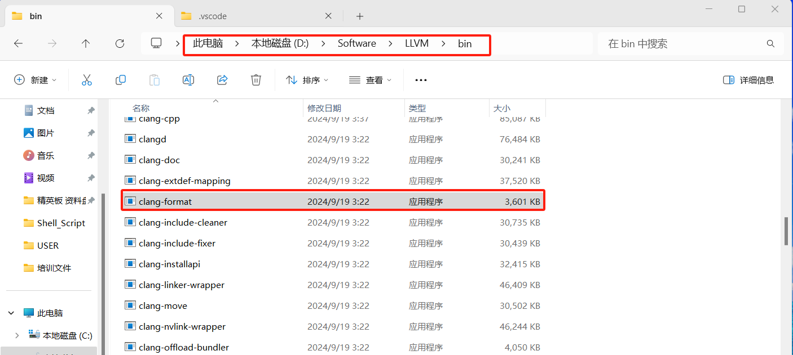
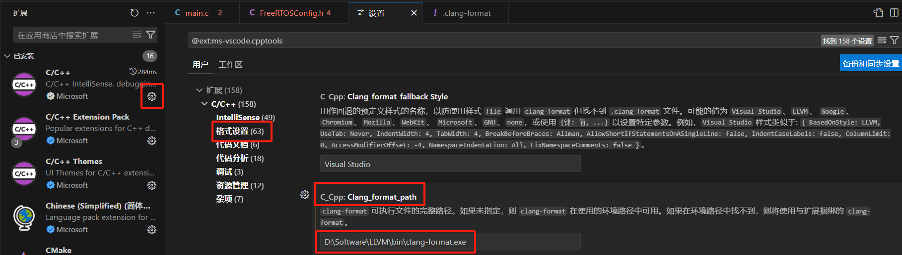
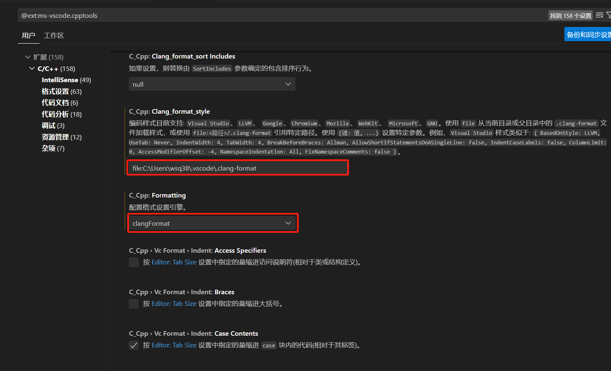

# clang-format在双平台Windows/Linux下的使用

​	项目开发过程中需要多个开发人员参与，然而每个开发者在开发时都有自己的一套格式化方式，有可能是默认格式化模板，有可能是其他格式化模板，由此造成的问题是双方保存提交代码后会发现有很多地方不同，文件对比发现是一整片的红色差异，根本没有办法直观看到更改了哪里。由此，双方之间同步相同的格式化文件是十分重要的。

## clang-format介绍

​	Clang-format是一种代码格式化工具，可以用来格式化各种代码，支持`c`、`C++`、`Java`、`Javascript`、`Objective-C`、`C#`等多种语言。

​	Clang-format支持多种格式以格式化文档。有`LLVM`、`Google`、`Chromium`、`mozilla`、`WebKit`、`Miscrosoft`、`GNU`等多种类型。


## clang-format运行原理

​	首先，我们要区分两个东西，一个是clang-format工具，这是一个软件工具，而clang-format插件是有Vscode拓展市场中提供的程序，用于拓展功能以及特性。

​	clang-format插件将调用clang-format软件工具生成/分析`.clang-format`文件得到格式化信息。并由此信息格式化文档。由此，我们需要设置的要素有

1. clang-format插件
2. clang-format软件工具
3. `.clang-format`文件

## Windows平台下使用方式

### 1.clang-format插件

​	由于在Windows平台下开发C语言，我们推荐使用`C/C++`插件，该款插件内置clang-format的集成选项，开发者不需要额外安装clang-format插件，只需要使用安装`C/C++`插件即可实现代码跳转以及代码格式化。


### 2.clang-format软件工具

​	Windows下需要下载软件工具,[gitlab下载地址](https://github.com/llvm/llvm-project/releases/tag/llvmorg-19.1.0)。

​	下载`LLVM-19.1.0-win64.exe`并安装，随后将路径写进VScode插件`C/C++`中。这里一定要写完全，写到clang-format.exe.

​	





### 3. `.clang-format`文件

​	该文件可以从网上抄取现有的模板。也可以通过clang-format工具生成，生成命令如下：

```shell
clang-format -style=google -dump-config > .clang-format
```

​	命令中的`google`可以更改为其他格式如`Chromium`、`mozilla`、`WebKit`等。

​	可以更改自动生成的.clang-format文件以生成开发者喜欢的格式。

​	随后，在VScode C/C++插件中设置文件路径并设置引擎。



### 4. 在代码界面中配置格式化工具

​	右键鼠标->选择使用...格式化工具->配置默认格式化工具->C/C++

​	配

置完上述后保存即可正常使用clang-format工具。

​	可以更改.clang-format文件中`IndentWidth`字段验证clang-format是否生效。

## Linux环境下使用

	### 1.clang-format插件

​	在linux环境中开发，推荐使用`clangd`插件，插件Clangd本身支持根据`.clang-format`文件进行格式化。故不需要安装其他插件。

### 2.clang-format软件

​	在linux环境下不用安装该软件工具

### 3.`.clang-format`文件

​	需要在待格式化的项目父目录下防止`.clang-format`文件。该文件生成方式参考windows下使用方式3

### 4.配置格式化工具

​	右键鼠标->选择使用...格式化工具->配置默认格式化工具->Clangd

## 注意点：

1. windows环境下使用时，如果发现没生效，且终端输出中显示 **格式化失败**，其中原因有可能是clang-format路径错误，一定要写完全，一直明确到clang-format.exe。
2. windows环境下使用时，如果发现没生效，且终端输出中显示 **Got empty plain scalar**，问题有可能是因为`.clang-format`文件的编码不对，建议改成UTF-8 with BOM。

